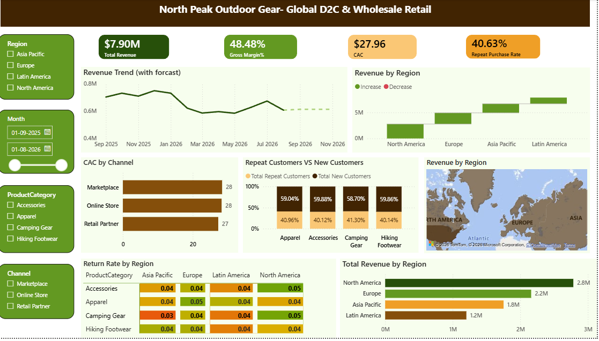

# NorthPeak Outdoor Gear - Power BI Sales Analytics Dashboard

## Project Overview

This project is a Power BI sales analytics dashboard created for **NorthPeak Outdoor Gear**, a hypothetical outdoor retail company selling hiking footwear, apparel, camping gear, and accessories.

The dashboard analyzes 12 months of sales data from **September 2025 to August 2026** across multiple regions, sales channels, and product categories.

The goal of the project is to turn raw sales data into an interactive dashboard that helps understand revenue, profitability, customer acquisition, repeat purchases, regional performance, and product returns.

## Dashboard Pages

### 1. Overview

The Overview page explains the business scenario and summarizes the project development process, including:

* Business strategy
* Data modeling
* Dashboard planning
* Evaluation and testing
* Final dashboard development

### 2. Dashboard

The main dashboard provides an interactive view of business performance.

It includes:

* Total Revenue
* Gross Margin %
* Customer Acquisition Cost (CAC)
* Repeat Purchase Rate
* Monthly Revenue Trend
* Revenue Forecast
* Revenue by Region
* CAC by Channel
* New vs Repeat Customers
* Revenue by Region Map
* Return Rate by Product Category and Region

### 3. Key Insights

The Key Insights page summarizes important findings from the analysis.

Some major observations include:

* Total revenue is approximately **$7.90M**
* Overall gross margin is approximately **48.5%**
* North America is the largest revenue-generating region
* Camping Gear is the largest product category by revenue
* Retail Partner has the lowest CAC among the major channels
* Europe / Retail Partner has the lowest-margin regional-channel combination
* Some low-volume segments show higher CAC volatility

## Key KPIs

| KPI                  | Description                                         |
| -------------------- | --------------------------------------------------- |
| Total Revenue        | Total sales revenue generated                       |
| Gross Margin %       | Percentage of revenue remaining after cost of goods |
| CAC                  | Customer Acquisition Cost                           |
| Repeat Purchase Rate | Percentage of customers making repeat purchases     |
| Return Rate          | Percentage of sales/orders returned                 |

## Filters

The dashboard provides interactive filters for:

* Region
* Month
* Product Category
* Channel

These filters allow users to analyze business performance at different levels.

## Data

The dataset contains approximately **576 rows** covering:

* 12 months of data
* 4 regions
* 3 sales channels
* Multiple product categories

### Regions

* North America
* Europe
* Asia Pacific
* Latin America

### Sales Channels

* Online Store
* Retail Partner
* Marketplace

### Product Categories

* Camping Gear
* Accessories
* Apparel
* Hiking Footwear

## Tools Used

* Power BI Desktop
* Power Query
* DAX
* Microsoft Excel / CSV
* GitHub

## Analysis Process

The project followed these main steps:

1. Defined the business problem and key questions.
2. Prepared and reviewed the sales dataset.
3. Created the Power BI data model.
4. Developed DAX measures for the required KPIs.
5. Designed the dashboard layout.
6. Added interactive slicers and visualizations.
7. Added revenue forecasting.
8. Tested the dashboard using different filter combinations.
9. Identified and documented important business insights.
10. Published the final project to GitHub.

## Dashboard Preview

### Main Dashboard




## Project Structure

```text
northpeak-outdoor-gear-powerbi-dashboard/
│
├── README.md
│
├── PowerBI/
│   └── NorthPeak_Outdoor_Gear_Dashboard.pbix
│
├── Data/
│   └── NorthPeak_Raw_SalesData.csv
│
├── Screenshots/
│   ├── dashboard-main.png
│   
│
└── Documentation/
    └── project-notes.md
```

## Key Business Questions

This dashboard helps answer questions such as:

1. How much revenue is the business generating?
2. Which regions generate the most revenue?
3. Which channels have the most efficient customer acquisition?
4. Which product categories perform best?
5. What is the relationship between new and repeat customers?
6. Which regions and categories have higher return rates?
7. How is revenue expected to trend in the future?

## Important Note

NorthPeak Outdoor Gear is a hypothetical business created for this analytics project. The dataset is used for educational and portfolio purposes.

## Author

**Prashant Singh**

This project was created as a Power BI data analytics portfolio project.

